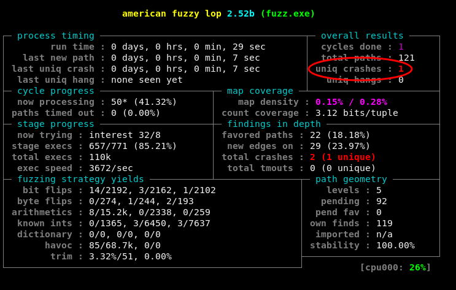

# OCaml AFL fuzzing examples

Small examples of how to use AFL to fuzz OCaml programs

These examples are here to help you quickly get set up with AFL and to illustrate an upcoming
article on the [Tarides blog](https://tarides.com/blog.html).

## Setup

To be able to correctly run the examples in this repo and toy around with fuzzing you will need to
install `afl` and have a `+afl` opam switch so that the binaries are properly instrumented for
fuzzing.

You can setup the afl switch by running:
```
$ opam switch create fuzzing-switch 4.07.1+afl
```

You can either install AFL from your distribution, e.g. on Debian:
```
$ apt update && apt install afl
```

Or by using the convenience opam package:
```
$ opam install --switch=fuzzing-switch afl
```

Some of the examples have extra dependencies such as `crowbar` and `bun`. You can install all of them by
running:

```
$ opam install --switch=fuzzing-switch crowbar bun
```

## Simple parser

The `simple-parser` folder contains the most basic example and shows how you can use afl-fuzz to fuzz a
simple parsing function written in OCaml. 

The `lib` subfolder contains a library with a single `parse_int` function that parses an int from a
string, with a little twist.

The `fuzz` subfolder contains the code to be compiled to the fuzzing binary `fuzz.exe` which must be
passed to afl and an `input/` folder with a couple starting test cases.

You can try fuzzing it by yourself:
```
$ dune build simple-parser/fuzz/fuzz.exe
$ afl-fuzz -i simple-parser/fuzz/input -o _build/default/simple-parser/fuzz/output _build/default/simple-parser/fuzz/fuzz.exe
```

Or simply run:
```
$ dune build @fuzz-simple-parser --no-buffer
```

which will do pretty much exactly the above.

AFL should find the crash fairly quickly. It will show up in the top right corner of `afl-fuzz`'s
output, under `uniq crashes`, see the picture below.



You can inspect the input that triggered the crash by running:
```
$ cat _build/default/simple-parser/fuzz/output/crashes/id*
```

and reproduce it by running:
```
$ ./_build/default/simple-parser/fuzz/fuzz.exe _build/default/simple-parser/fuzz/output/crashes/id*
```
